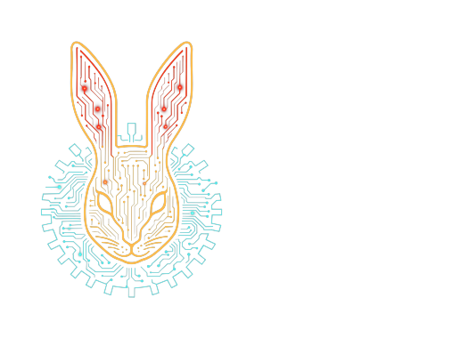

<!-- BANNER -->
<p align=center></p>
<!-- /BANNER -->

<p align=center>
    <a href="https://pypi.org/project/lang-mu/"></a>
    <a href="https://pypi.org/project/lang-mu/"></a>
    <a href="https://github.com/wabbit-corp/python-lang-mu/actions/workflows/docs-quality.yml"></a>
</p>

<p align=center>
    <a href="https://github.com/wabbit-corp/python-lang-mu/blob/master/LICENSE.md"></a>
    <a href="https://github.com/wabbit-corp/python-lang-mu"></a>
</p>

---

`lang-mu` is a Python distribution for the `mu` package, an implementation of
the Mu configuration language.

It provides:

- A parser that preserves Mu syntax as an AST.
- A typed decoder that maps Mu expressions into Python dataclasses and typing constructs.
- An experimental runtime evaluator (`mu.exec`) for callable execution semantics.

## Overview

Mu configuration files can describe nested structures, tagged records, and
mixed positional/named arguments. This package gives you a strict, testable way
to parse and decode those configs into Python types.

## Installation

```bash
pip install lang-mu
```

## Quickstart: Parsing

```python
from mu import AtomExpr, Document, GroupExpr, parse

source = """
; application plus shared includes
(app-jvm "billing-api"
  :main "billing.Main"
  :ports [8080 8443]
  :env {profile: prod, region: us-east-1}
)
(include "shared/logging.mu")
"""

doc = parse(source)
assert isinstance(doc, Document)
assert len(doc.exprs) == 2

app = doc.exprs[0]
assert isinstance(app, GroupExpr)
assert isinstance(app.values[0], AtomExpr)
assert app.values[0].value == "app-jvm"
```

### Parser Literals

The parser supports both single- and double-quoted strings, and parses numeric
literals into dedicated AST node types:

- `SInt` for integers
- `SReal` for real numbers and percentages
- `SRational` for rational values

```python
from mu import parse
from mu.types import AtomExpr, SInt, SRational, SReal, StringExpr

doc = parse("'hi' 42 1.5 50% 2/3 first'")
assert doc.exprs == [
    StringExpr("hi"),
    SInt(42),
    SReal(1.5),
    SReal(0.5),
    SRational((2, 3)),
    AtomExpr("first'"),
]
```

## Quickstart: Typed Decoding

```python
from dataclasses import dataclass

from mu import parse_one


@dataclass
class Http:
    port: int


@dataclass
class Worker:
    queue: str


@dataclass
class Service:
    name: str
    mode: Http | Worker


cfg = parse_one('(service "api" :mode (http :port 8080))', Service)
assert cfg == Service(name="api", mode=Http(port=8080))
```

## Error Handling

Typed decoding raises `DecodeError` with structured context:

- `path`: decode path (for example `$.field[0]`)
- `expected`: human-readable expected target/type
- `got`: actual Mu expression description
- `span`: optional source span/token information
- `cause`: optional underlying exception

```python
from dataclasses import dataclass
from mu import DecodeError, parse_one


@dataclass
class Counter:
    value: int


try:
    parse_one('(counter :value "not-an-int")', Counter)
except DecodeError as e:
    print(e.path, e.expected, e.got)
```

## API Contract

### Stable API (`from mu import ...`)

- Stable symbol reference is generated from code: `docs/api-stable.md`.
- Main entry points:
  - `parse`, `ParseError`
  - `parse_one`, `parse_many`, `decode`
  - `DecodeError`, `DecoderRegistry`, `Quoted`

### Experimental API (`from mu.exec import ...`)

- Experimental symbol reference is generated from code: `docs/api-experimental.md`.

The experimental runtime API is available but not considered stable yet.
Non-exported internals (for example `mu.arg_match` and parser private helpers)
are unsupported and may change without notice.

## Documentation

- User docs: <https://wabbit-corp.github.io/python-lang-mu/>
- Development guide: `docs/development.md`
- Changelog and release notes: `CHANGELOG.md`
- Contribution process: `CONTRIBUTING.md`
- Support and bug reports: <https://github.com/wabbit-corp/python-lang-mu/issues>
- Security-sensitive or private questions: `wabbit@wabbit.one`

## Python Support

- Python `>=3.10`

## Development and Release Checks

```bash
python scripts/generate_api_docs.py --check
python scripts/check_docs_links.py
pytest -q tests/test_docs_snippets.py
codespell README.md docs CHANGELOG.md CONTRIBUTING.md --ignore-words=.codespell-ignore-words.txt
mkdocs build --strict
pytest -q
ruff check .
python -m build --sdist --wheel
python -m twine check dist/*
./scripts/check_wheel_contents.sh
```

## Contributing and CLA

Before we can accept contributions, you must review and agree to the
Contributor License Agreement (CLA):

- Full agreement: `CLA.md`
- Simplified explanation (non-legal summary): `CLA_EXPLANATIONS.md`
- Contributor privacy notice: `CONTRIBUTOR_PRIVACY.md`

See `CONTRIBUTING.md` for contribution expectations and required checks.

## Licensing

This project is licensed under **AGPL-3.0-or-later**. See `LICENSE.md` for
the full text.

Wabbit Consulting Corporation may also offer commercial licensing options.
For commercial inquiries, contact `wabbit@wabbit.one`.
